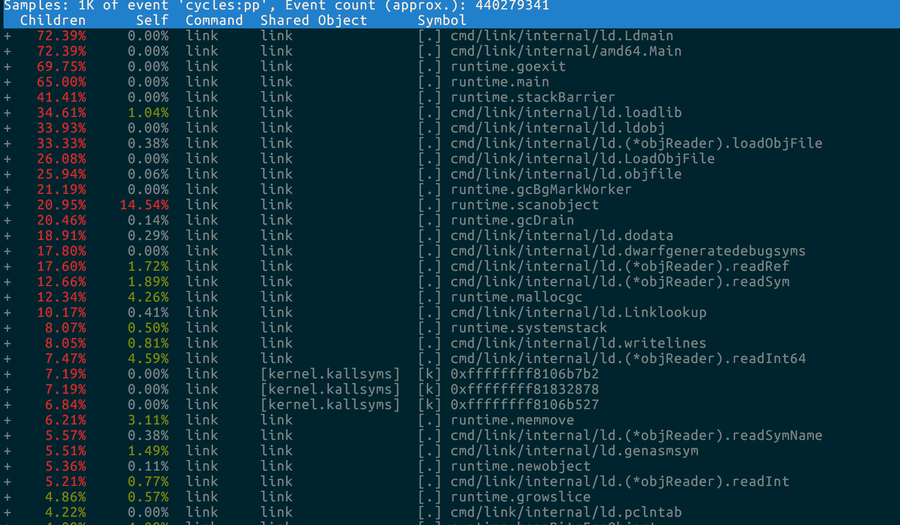

# Profiling and Benchmarking
In this section we’ll explore the ways you can make your application faster by exploring Go’s tools for profiling, benchmarking and optimization.  You’ll see demonstrations of profiling and optimization workflows that you can use to find the performance bottlenecks in your applications.  Hands-on labs and assignments will give you the confidence to profile your own applications.

- GODEBUG
- pprof and debug/pprof
- Benchmarks
- perf
- go tool trace

# Benchmarking

Before you can begin to tune your application, you must first know how to tell if your changes are making things better, or worse.

You must first establish a reliable baseline to measure the impact of your change.

	In other words, _"Don't_guess,_measure"_

This section focuses on how to construct useful benchmarks using the Go testing framework, and gives practical tips for avoiding the pitfalls.

Benchmarking is closely related to profiling, which we'll touch on during this section, then cover it in detail in the next.

## Benchmarking ground rules

Before you benchmark, you must have a stable environment to get repeatable results.

- The machine must be idle—don't profile on shared hardware, don't browse the web while waiting for a long benchmark to run.
- Watch out for power saving and thermal scaling.
- Avoid virtual machines and shared cloud hosting; they are too noisy for consistent measurements.
- There is a kernel bug on OS X versions less than El Capitan; upgrade or avoid profiling on OS X.

If you can afford it, buy dedicated performance test hardware. Rack it, disable all the power management and thermal scaling and never update the software on those machines.

For everyone else, have a before and after sample and run them multiple times to get consistent results.

## Using the testing package for benchmarking

Having a function to benchmark

	// Fib computes the n'th number in the Fibonacci series.
	func Fib(n int) int {
		if n < 2 {
			return n
		}
		return Fib(n-1) + Fib(n-2)
	} 
**snippet from profbench/includes/fib/fib.go*

You can bechmark it using following pattern

	import "testing"

	func BenchmarkFib(b *testing.B) {
		for n := 0; n < b.N; n++ {
			Fib2(20) // run the Fib function b.N times
		}
	} 
**snippet from profbench/includes/fib/fib_test.go*

## Comparing benchmarks

Determining performance improvements when there are more than one benchmark in a package can be overwhelming.

You should always run your benchmarks multiple times to eliminate background noise.

Tools like [rsc.io/benchstat](https://godoc.org/rsc.io/benchstat) are useful for comparing before and after comparisons.

	% go test -bench=. -count=20 > old.txt // note -count>1 need samples!
		
	% go test -bench=. -count=20 > new.txt
	% benchstat old.txt new.txt  
		
	name   old time/op  new time/op  delta
	Fib-4   378ns ± 0%   237ns ± 0%  -37.30%  (p=0.000 n=14+16)

## Watch out for compiler optimizations

How fast will this benchmark run?

const m1 = 0x5555555555555555
const m2 = 0x3333333333333333
const m4 = 0x0f0f0f0f0f0f0f0f
const h01 = 0x0101010101010101

func popcnt(x uint64) uint64 {
	x -= (x >> 1) & m1
	x = (x & m2) + ((x >> 2) & m2)
	x = (x + (x >> 4)) & m4
	return (x * h01) >> 56
}

func BenchmarkPopcnt(b *testing.B) {
	//	var r uint64
	for i := 0; i < b.N; i++ {
		popcnt(uint64(i))
	}
}

### What happened?

`popcnt` is a leaf function, so the compiler can inline it.

Because the function is inlined, the compiler can see it has no side effects, so the call is eliminated. This is what the compiler sees:

	func BenchmarkPopcnt(b *testing.B) {
		for i := 0; i < b.N; i++ {
			// optimized away
		}
	} 

The same optimizations that make real code fast, by removing unnecessary computation, are the same ones that remove benchmarks that have no observable side effects.

This is only going to get more common as the Go compiler improves.

## Benchmark mistakes

### Benchmarking expensive setup

Use b.ResetTimer() after doing setup so it won't be counted:

	func BenchmarkBigLen(b *testing.B) {
		big := NewBig()
		b.ResetTimer()
		for i := 0; i < b.N; i++ {
			big.Len()
		}
	}

Applies to any setup that needs to be done that you don't want to benchmark
	
# Compiler flags

Showing the assembly output of a package:

- `-S` prints the (Go flavored) assembly of a function
- `-l` controls the behavior of the inliner, `-l` disables inlining, `-l -l` increases it. Experiment with the difference.
- `-m` controls printing of optimization decision like inlining, escape analysis.

# Performance measurement and profiling

The best way to make your application faster is by improving inefficient code. But how can you tell which code is inefficient? 

You've got to measure it!  Go has you covered with the built-in `pprof` toolset.

# pprof

The primary tool we're going to be talking about today is _pprof_.

pprof descends from the Google Perf Tools suite of tools.

`pprof` profiling is built into the Go runtime.

It comes in two parts:

- `runtime/pprof` package built into every Go program
- `go` tool `pprof` for investigating profiles.

pprof supports several types of profiling, we'll discuss three of these: 

- CPU profiling.
- Memory profiling.
- Block (or blocking) profiling.

## CPU profiling

CPU profiling is the most common type of profile, and the most obvious. 

When CPU profiling is enabled the runtime will interrupt itself every 10ms and record the stack trace of the currently running goroutines.

Once the profile is complete we can analyze it to determine the hottest code paths.

The more times a function appears in the profile, the more time that code path is taking as a percentage of the total runtime.

## Memory profiling

Memory profiling records the stack trace when a _heap_ allocation is made.

Stack allocations are assumed to be free and are _not_tracked_ in the memory profile.

Memory profiling, like CPU profiling is sample based, by default memory profiling samples 1 in every 1000 allocations. This rate can be changed.

Because of memory profiling is sample based and because it tracks _allocations_ not _use_, using memory profiling to determine your application's overall memory usage is difficult.

## Block profiling

Block profiling is quite unique. 

A block profile is similar to a CPU profile, but it records the amount of time a goroutine spent waiting for a shared resource.

This can be useful for determining _concurrency_ bottlenecks in your application.

Block profiling can show you when a large number of goroutines _could_ make progress, but were _blocked_. 

Blocking includes:

- Sending or receiving on a unbuffered channel.
- Sending to a full channel, receiving from an empty one.
- Trying to `Lock` a `sync.Mutex` that is locked by another goroutine.

Block profiling is a very specialized tool, it should not be used until you believe you have eliminated all your CPU and memory usage bottlenecks.

## One profile at at time

Profiling is not free.

Profiling has a moderate, but measurable impact on program performance—especially if you increase the memory profile sample rate.

Most tools will not stop you from enabling multiple profiles at once.

If you enable multiple profiles at the same time, they will observe their own interactions and throw off your results.

	Do not enable more than one kind of profile at a time.

## Using pprof

Now that I've talked about what pprof can measure, I will talk about how to use pprof to analyze a profile.

pprof should always be invoked with _two_ arguments.

    go tool pprof /path/to/your/binary /path/to/your/profile

The `binary` argument *must* be the binary that produced this profile.

The `profile` argument *must* be the profile generated by this binary.

*Warning*: Because pprof also supports an online mode where it can fetch profiles from a running application over http, the pprof tool can be invoked without the name of your binary [issue 10863](https://github.com/golang/go/issues/10863):

    go tool pprof /tmp/c.pprof

*Do not do this or pprof will report your profile is empty.*

This is a sample cpu profile:

	% go tool pprof $BINARY /tmp/c.p
	Entering interactive mode (type "help" for commands)
	(pprof) top
	Showing top 15 nodes out of 63 (cum >= 4.85s)
	      flat  flat%   sum%        cum   cum%
	    21.89s  9.84%  9.84%    128.32s 57.71%  net.(*netFD).Read
	    17.58s  7.91% 17.75%     40.28s 18.11%  runtime.exitsyscall
	    15.79s  7.10% 24.85%     15.79s  7.10%  runtime.newdefer
	    12.96s  5.83% 30.68%    151.41s 68.09%  test_frame/connection.(*ServerConn).readBytes
	    11.27s  5.07% 35.75%     23.35s 10.50%  runtime.reentersyscall
	    10.45s  4.70% 40.45%     82.77s 37.22%  syscall.Syscall
	     9.38s  4.22% 44.67%      9.38s  4.22%  runtime.deferproc_m
	     9.17s  4.12% 48.79%     12.73s  5.72%  exitsyscallfast
	     8.03s  3.61% 52.40%     11.86s  5.33%  runtime.casgstatus
	     7.66s  3.44% 55.85%      7.66s  3.44%  runtime.cas
	     7.59s  3.41% 59.26%      7.59s  3.41%  runtime.onM
	     6.42s  2.89% 62.15%    134.74s 60.60%  net.(*conn).Read
	     6.31s  2.84% 64.98%      6.31s  2.84%  runtime.writebarrierptr
	     6.26s  2.82% 67.80%     32.09s 14.43%  runtime.entersyscall

Often this output is hard to understand.

A better way to understand your profile is to visualise it using a web command.

	% go tool pprof application /tmp/c.p
	Entering interactive mode (type "help" for commands)
	(pprof) web

Opens a web page with a graphical display of the profile.

I find this method to be superior to the text mode, I strongly recommend you try it.

pprof also supports these modes in a non interactive form with flags like `-svg`, `-pdf`, etc. 

See `go` tool `pprof` -help for more details.

[Further reading: Profiling Go programs](http://blog.golang.org/profiling-go-programs)

[Further reading: Debugging performance issues in Go programs](https://software.intel.com/en-us/blogs/2014/05/10/debugging-performance-issues-in-go-programs)

Let's cover the other two profile types.

Here is a visualization of a memory profile:

    % go build -gcflags='-memprofile=/tmp/m.p'
    % go tool pprof --alloc_objects -svg ./gogrep /tmp/m.p > alloc_objects.svg
    % go tool pprof --inuse_objects -svg ./gogrep /tmp/m.p > inuse_objects.svg

alloc_objects tells you how many objects were allocated.

inuse_objects tells you how many objects are still in use.

Here is a visualizaton of a block profile:

    % go test -blockprofile block.out -blockprofilerate 1 -bench=.
    % go tool pprof -svg gogrep.test block.out > block.svg

## How pprof works

The Go runtime's profiling interface is in the `runtime/pprof` package.

`runtime/pprof` is a very low level tool, and for historic reasons the interfaces to the different kinds of profile are not uniform.

To make it easier to profile your code you should use a higher level interface.

# Profiling benchmarks

The `testing` package has built in support for generating CPU, memory, and block profiles.

- `-cpuprofile=$FILE` writes a CPU profile to `$FILE`. 
- `-memprofile=$FILE`, writes a memory profile to `$FILE`,
	- `-memprofilerate=N` adjusts the profile rate to `1/N`.
- `-blockprofile=$FILE`, writes a block profile to `$FILE`.

Using any of these flags also preserves the binary.

    % go test -run=XXX -bench=. -cpuprofile=c.p bytes
    % go tool pprof bytes.test c.p

_Note:_ use `-run=XXX` to disable tests, you only want to profile benchmarks.

# Profiling applications

Profiling `testing` benchmarks is useful for _microbenchmarks_.

We use microbenchmarks inside the standard library to make sure individual packages do not regress, but what if you want to profile a complete application?

As I mentioned in the previous section, to profile an application, you must use the `runtime/pprof` package, but that is fiddly and low level.

To make this easier, a few years ago Dave Cheney wrote a small package, [github.com/pkg/profile](https://github.com/pkg/profile), to make it easier to profile an application.

     import "github.com/pkg/profile

     func main() {
           defer profile.Start().Stop()
           ...
     }

# Framepointers

Go 1.7 has been released and along with a new compiler for amd64, the compiler now enables frame pointers by default.

The frame pointer is a register that always points to the top of the current stack frame.

Framepointers enable tools like `gdb(1)`, and `perf(1)` to understand the Go call stack.

# perf

If you're a linux user, then `perf(1)` is a great tool for profiling applications. Now we have *frame pointers*, `perf` can profile Go applications.

        % go build -toolexec="perf stat" cmd/compile/internal/gc
        # cmd/compile/internal/gc

         Performance counter stats for '/home/bketelsen/go/pkg/tool/linux_amd64/compile -o $WORK/cmd/compile/internal/gc.a -trimpath $WORK -p cmd/compile/internal/gc -complete -buildid 87cd803267511b4d9e753d68b5b66a70e2f878c4 -D _/home/bketelsen/go/src/cmd/compile/internal/gc -I $WORK -pack ./alg.go ./align.go ./bexport.go ./bimport.go ./builtin.go ./bv.go ./cgen.go ./closure.go ./const.go ./cplx.go ./dcl.go ./esc.go ./export.go ./fmt.go ./gen.go ./go.go ./gsubr.go ./init.go ./inl.go ./lex.go ./magic.go ./main.go ./mpfloat.go ./mpint.go ./obj.go ./opnames.go ./order.go ./parser.go ./pgen.go ./plive.go ./popt.go ./racewalk.go ./range.go ./reflect.go ./reg.go ./select.go ./sinit.go ./sparselocatephifunctions.go ./ssa.go ./subr.go ./swt.go ./syntax.go ./type.go ./typecheck.go ./universe.go ./unsafe.go ./util.go ./walk.go':

               7026.140760 task-clock (msec)         #    1.283 CPUs utilized
                     1,665 context-switches          #    0.237 K/sec
                        39 cpu-migrations            #    0.006 K/sec
                    77,362 page-faults               #    0.011 M/sec
            21,769,537,949 cycles                    #    3.098 GHz                     [83.41%]
            11,671,235,864 stalled-cycles-frontend   #   53.61% frontend cycles idle    [83.31%]
             6,839,727,058 stalled-cycles-backend    #   31.42% backend  cycles idle    [66.65%]
            27,157,950,447 instructions              #    1.25  insns per cycle
                                                     #    0.43  stalled cycles per insn [83.25%]
             5,351,057,260 branches                  #  761.593 M/sec                   [83.49%]
               118,150,150 branch-misses             #    2.21% of all branches         [83.15%]

               5.476816754 seconds time elapsed

## perf record

        % go build -toolexec="perf record -g -o /tmp/p" cmd/compile/internal/gc
        % perf report -i /tmp/p

# Flame graphs

	"The x-axis shows the stack profile population, sorted alphabetically (it is not the passage of time), and the y-axis shows stack depth. Each rectangle represents a stack frame. The wider a frame is is, the more often it was present in the stacks. The top edge shows what is on-CPU, and beneath it is its ancestry. The colors are usually not significant, picked randomly to differentiate frames."
*[flamegraphs](http://www.brendangregg.com/flamegraphs.html)

- *x*axis*: alphabetical stack sort, to maximize merging.
- *y*axis*: stack depth.

## Flame graph interpretation 

*[performance analysis on linux with flame graphs](http://www.slideshare.net/brendangregg/java-performance-analysis-on-linux-with-flame-graphs)

Flame graphs can consume data from many sources, including `pprof` (and `perf(1)`).

Uber have open sourced a tool call [go-torch](https://github.com/uber/go-torch) which automates the process, assuming you have the `/debug/pprof` endpoint, or you can feed it an existing profile.

        % go build -gcflags=-cpuprofile=/tmp/c.p .
        % go-torch $(go tool compile -n) /tmp/c.p
        INFO[16:00:09] Run pprof command: go tool pprof -raw -seconds 30 /Users/bketelsen/go/pkg/tool/darwin_amd64/compile /tmp/c.p
        INFO[16:00:09] Writing svg to torch.svg

# go tool trace

In Go 1.5, Dmitry Vyukov added a new kind of profiling to the runtime; [execution trace profiling](https://golang.org/doc/go1.5#trace_command).

Gives insight into dynamic execution of a program.

Captures with nanosecond precision:

- goroutine creation/start/end
- goroutine blocking/unblocking
- network blocking
- system calls
- GC events

Execution traces are essentially undocumented ☹️, see [github/go#16526](https://github.com/golang/go/issues/16526)

Generating a profile (with [CL 25354](https://go-review.googlesource.com/#/c/25354/) applied):

        % go build -gcflags=-traceprofile=/tmp/t.p cmd/compile/internal/gc

Viewing the trace:

	% go tool trace /tmp/t.p
	2016/08/13 17:01:04 Parsing trace...
	2016/08/13 17:01:04 Serializing trace...
	2016/08/13 17:01:05 Splitting trace...
	2016/08/13 17:01:06 Opening browser

Demo:

	cd $GOPATH/src/github.com/gophertrain/material/profbench/demos/gogreptrace
	go tool trace trace.out

Bonus: [`github.com/pkg/profile`](https://github.com/pkg/profile/releases/tag/v1.2.0) supports generating trace profiles.

        defer profile.Start(profile.TraceProfile).Stop()

# Exercises

Profile gogrep using your choice:

	cd $GOPATH/src/github.com/gophertrain/material/profbench/exercises/gogrep

- pprof
- go-uber
- go tool trace
