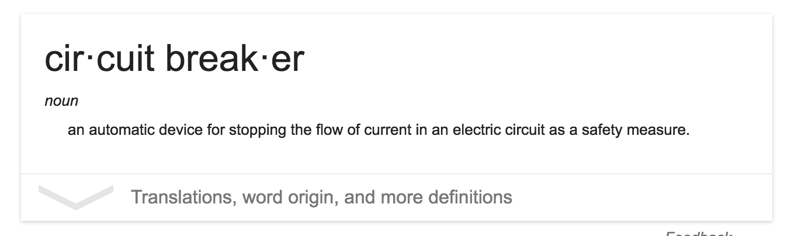

# Building Resilient Applications

In this section we’ll discuss the techniques and tools you can use to keep your application running in a world of unreliable networks and cloud services.  We’ll explore rate limiting to keep greedy consumers from taking your application offline.  We’ll build circuit breakers to prevent cascading failures, and we’ll see patterns for graceful retries, backoffs and fallbacks for those times when the world around your application collapses.

- Circuit Breakers 
- Rate Limiting
- Retries, Backoffs 
- Graceful Fallbacks

# Circuit Breakers 

### What is a circuit breaker?

http://martinfowler.com/bliki/CircuitBreaker.html

### Why use one?

To prevent upstream failures from breaking your application.

	TO MAINTAIN CONTROL OF YOUR APPLICATION'S PERFORMANCE UNDER FAILURE CONDITIONS

### Go Circuit Breakers

- https://github.com/sony/gobreaker
- https://github.com/streadway/handy
- https://github.com/afex/hystrix-go

# Rate Limiting

### What is rate limiting?

	Rate Limiting is the act of controlling the number of requests to a service
	over a specific time period.

### Why do you need it?
	
- Rate Limiting prevents greedy clients from consuming all the resources available
	in your system.
- Rate Limiting helps to prevent Denial of Service Attacks

https://github.com/juju/ratelimit
	
	Generic rate limiter, uses bytes in a token bucket
	If you can read a byte, you haven't exceeded rate

https://github.com/throttled/throttled

	Specific rate limiter for http handlers as a middleware

## Exercise

	src/resilientapps/exercises/service

- Add throttled to this simple web application
- Don't forget to import the package correctly - `go get gopkg.in/throttled/throttled.v2`

# Retries, Backoffs 

### Why?

	You need to perform a function, but it may fail.
	
### When is it OK?
	
- When you can be sure that the function you're calling is idempotent
- An operation is idempotent when it can be called more than once without duplicating the result

[Retries and Backoffs in Go](https://github.com/cenk/backoff)

# Graceful Fallbacks

Just theory here.  The concept of a graceful fallback is about user experience and product continuity.

When an upstream datasource fails, you should strive to provide the best experience for the end user that your service allows.  Of course, this depends on the nature of the service.

## Examples:

- `Facebook` : Each piece of your facebook feed is retrieved independently.  If one of them fails, the frontend code will replace it with static content or hide that area of the page

- `Credit Bureau` : at a former company we depended on an external service to provide some risk assessment for a credit score.  It was frequently unreliable or slow.  So we built two models, one with that service and one without.  If the service failed, we used the risk model without that data.

# Wrapup

Building resilient applications is about controlling your environment rather than your environmnent controlling you.  Take charge of the results of your application and make choices to protect your application and provide a higher quality of service to your customers.

