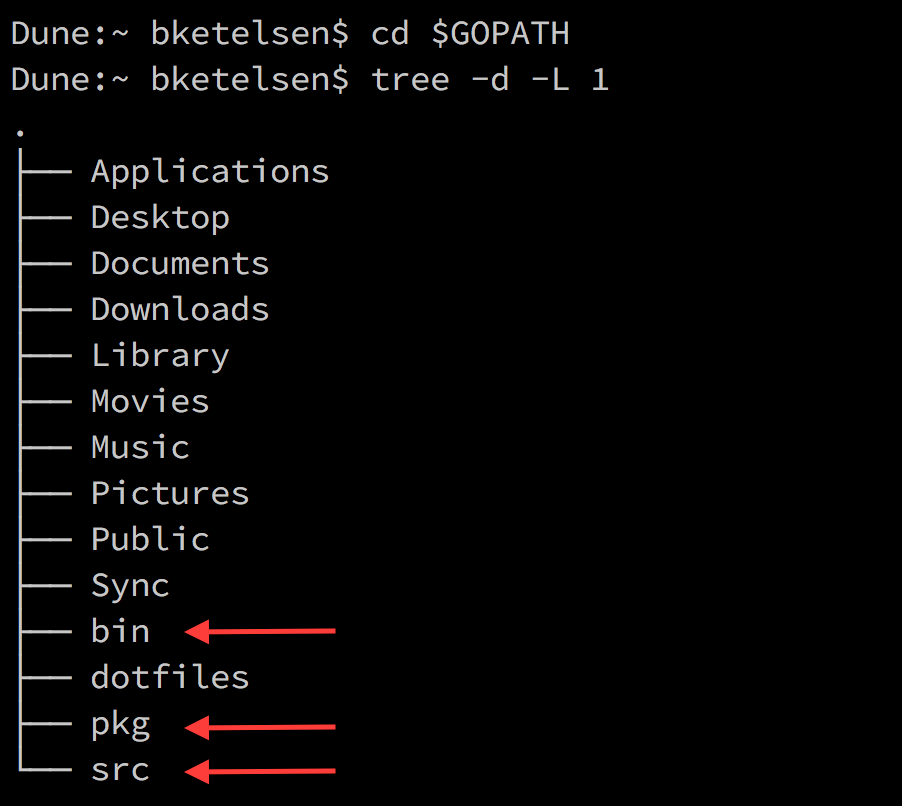

# 语法和类型

Go 的这些内建类型十分常见。

	uint8       无符号 8 位整数 (0 to 255)
	uint16      无符号 16 位整数 (0 to 65535)
	uint32      无符号 32 位整数 (0 to 4294967295)
	uint64      无符号 64 位整数 (0 to 18446744073709551615)
	int8        带符号 8 位整数 (-128 to 127)
	int16       带符号 16 位整数 (-32768 to 32767)
	int32       带符号 32 位整数 (-2147483648 to 2147483647)
	int64       带符号 64 位整数 (-9223372036854775808 to 9223372036854775807)
	float32     IEEE-754 32 位浮点数
	float64     IEEE-754 64 位浮点数
	complex64   实部和虚部为 float32 的复数
	complex128  实部和虚部为 float64 的复数
	byte        uint8 的别名
	rune        int32 的别名

# 特定实现类型

特定实现类型。 (在 64 位平台上实现为 64 位，32 位平台上实现为 32 位)

	uint     可能为 32 或 64 位的无符号整数
	int      带符号整数，位数与 uint 相同
	uintptr  可以完全容纳未解析的指针值的无符号整数

# 非数字类型

字符串和布尔类型

	string  字符串值
	bool    布尔值 (true/false)

# 声明变量并赋值

无初始化

	cd $GOPATH/src/github.com/thewondertwins/learngo/material/syntaxtypes/demos/withoutinit
	go run main.go

直接初始化，显式指定类型

	cd $GOPATH/src/github.com/thewondertwins/learngo/material/syntaxtypes/demos/explicit
	go run main.go

直接初始化，隐式指定类型

	cd $GOPATH/src/github.com/thewondertwins/learngo/material/syntaxtypes/demos/implicit
	go run main.go

所有这些程序都会生成一个整数，它们没有本质的区别。通过隐式声明，编译器在编译时确定变量的类型（而不是执行时）。

# Go 中的零值

所有的内建类型都有零值。所有分配了的变量尽管没有复制，但是都可以直接使用。

	cd $GOPATH/src/github.com/thewondertwins/learngo/material/syntaxtypes/demos/zero
	go run main.go

# 常量

常量的值无法在运行时修改。

	cd $GOPATH/src/github.com/thewondertwins/learngo/material/syntaxtypes/demos/constantstring
	go run main.go

	cd $GOPATH/src/github.com/thewondertwins/learngo/material/syntaxtypes/demos/constantnumber
	go run main.go

修改常量的例子 - 失败！

	cd $GOPATH/src/github.com/thewondertwins/learngo/material/syntaxtypes/demos/modifyconst
	go run main.go

# iota

有时需要定义遵从一个顺序的序列常量：

	cd $GOPATH/src/github.com/thewondertwins/learngo/material/syntaxtypes/demos/sequence
	go run main.go

这看起来有点丑。Go 允许叫做 iota 的编译时助手来避免重复：

iota 序列

	cd $GOPATH/src/github.com/thewondertwins/learngo/material/syntaxtypes/demos/iota
	go run main.go

是否留意到两个版本的不同呢？iota 总是从 0 开始计数。

跳过 iota 的第一个值

	cd $GOPATH/src/github.com/thewondertwins/learngo/material/syntaxtypes/demos/iotaskip
	go run main.go

# 结构体

结构体是一个字段的集合。

结构体是一种类型，可以没有字段或由多个字段组成。

结构体的实例：

	cd $GOPATH/src/github.com/thewondertwins/learngo/material/syntaxtypes/demos/structs
	go run main.go

字段在结构体中被称作成员。使用前缀和字段名来引用它们。

# 代码组织

Go 的代码被组织成包。同一个包的文件，在磁盘上中被存储为单一的目录。同一目录中，只可以包含相同包的文件。

你已经多次看到过这种形式。所有的例子都使用定义在文件顶部的包名“main”。

# 代码组织

所有的原文件必须在顶部将包名声明作为第一行代码：

	// Package declaration
	package main

一个可执行的程序必须含有 “main” 包并且声明 main() 函数：

	func main() { ...  }

库的代码必须使用与所在目录名一致的包名。在文件夹“server”中的代码必须声明为“package server”。

# 作用域

所有的变量和类型的声明在同一个包中是完全可见的。

这意味着没有“public”，“private”，“protected” 修饰符。

外部可见性是由大写规则控制。在包的外部可以使用包中名称首字母大写的类型和函数。而那些首字母小写的类型和函数不会暴露出去，外部不可访问它们。

我们管这个概念叫做“导出（Exporting）”。一个在它所在的包的外部访问的标识符，被称作“导出的（exported）”。

# 搜寻包

在刚刚安装好 Go 以后，需要在 shell 中设定 GOPATH 环境变量。

GOPATH 是一个可以含有一个或者多个 Go 项目的工作空间。

GOPATH 是工作空间的根，并且包含三个目录：

# 包

源代码和应用的依赖包存放在“src”中。

当生成一个应用时，它被保存于“bin”中。

编译任何的库的时候，编译结果保存于“pkg”下对应计算机架构的子目录。例如 pkg/darwin_amd64。

由于 GOPATH 被编译器用来决定如何搜索相关的包的代码，这也使得它变得非常重要。

# 搜寻包

如果代码存放在 $GOPATH/src/blue/red，包的名字是“red” 并且可以使用以下语句导入这些代码：

	import "blue/red"

“blue/red” 被称为包的导入路径。

像 github 或 bitbucket 这种代码库需要完整的路径名作为导入路径。在我的 github 库中有一个叫做“captainhook”的项目，具有以下导入路径：

	"github.com/bketelsen/captainhook"

# 搜寻包

因此，如果需要在代码中使用这个包，这个包必须存放于：

	$GOPATH/src/github.com/bketelsen/captainhook

如果 captainhook 是一个库，而不是一个可执行的应用，当其编译时，这个包编译的结果将会存放于：

	$GOPATH/pkg/darwin_amd64/github.com/bketelsen/captainhook
	(假设是在 Mac 系统中编译的)

# 包和 GOPATH

大部分开发者将会使用单一的 GOPATH，将其设定为环境变量，然后就不用再理会了。

然而对于不同的项目可以有不同的“干净环境”的设定。只需要创建一个新的 GOPATH 指向新的位置，然后设置成环境变量即可。

# 练习

阅读文章的前半部分，然后做练习 "Your First Program" 和 "Your First Library"。

[Getting Started with Go](https://golang.org/doc/code.html) 

请忽略文章中提及将 GOPATH 设置为 $HOME/work... 的部分。*不要修改你已经设定好的 GOPATH*

